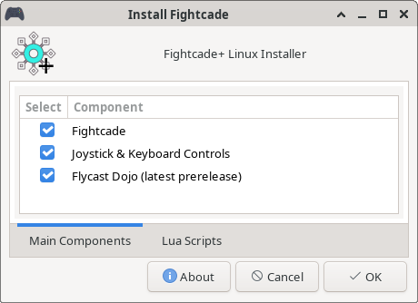
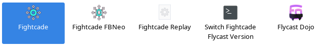

# FC+ Linux Installer

A graphical Linux installer for [Fightcade](https://www.fightcade.com/) and additional QoL enhancements.

Targets distributions based on Arch, Debian, and Ubuntu. 

<figure>
  <figcaption><i>FC Plus Linux Installer - Main Screen</i></figcaption>
  
</figure>

<figure>
  <figcaption><i>Installed Desktop Environment Shortcuts</i></figcaption>
  
</figure>

## Features
* Dependencies from native software repositories
  * `apt` on Ubuntu & Debian distributions
  * `pacman`/`yay` on Arch distributions
* Latest Fightcade Installer
* [Joystick & Keyboard Navigation](https://github.com/blueminder/fightcade-joystick-kb-controls)
* Latest [Flycast Dojo](https://github.com/blueminder/flycast-dojo) Prerelease
  * *Switch Fightcade Flycast Version* Shortcut to easily swap versions between games.
* [DXVK](https://github.com/doitsujin/dxvk) (Arch-based distributions)
  * Allows you to use *DirectX 9 Alt* Video Blitter in FBNeo
* Preinstalled Lua scripts for select games
  * [Nailok's VF4 Training Mode](https://github.com/Nailok/VF4-Training)
  * [Grouflon's SFIII 3rd Strike Training Lua](https://github.com/Grouflon/3rd_training_lua)

## Tested On
* EndeavourOS 03-2023 (Arch Linux)
* Ubuntu 22.04
* Linux Mint 21.1
* Debian 12 (bookworm)

## Installation Instructions
* Download `fcplus_installer.sh` from [Releases](https://github.com/blueminder/fcplus-linux-installer/releases)
* Open a terminal and run `chmod +x fcplus_installer.sh && ./fcplus_installer.sh`
* Follow the graphical prompts

Once everything is installed, you should see shortcuts to Fightcade in the menu of your desktop environment. Your Fightcade installation may be found in `~/.fightcade2`.

## Development
If you wish to modify the installer, download the code to this repository and make your edits to `install_script.sh`. You may add files to the `payload` folder if needed.

Once you are done with your changes, run `./create_installer.sh` to generate the final installer shell script ready for distribution.
